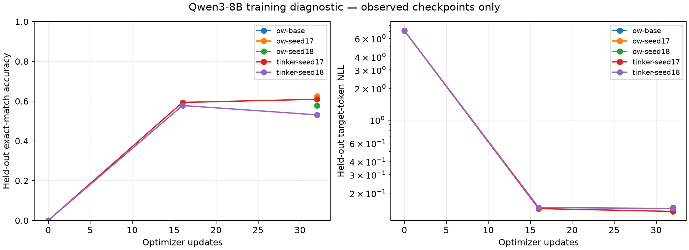
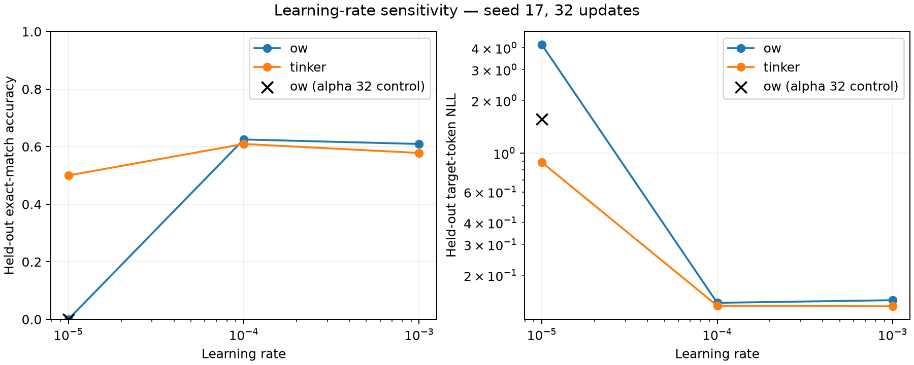

# Training comparison: observed results

This is a small diagnostic experiment, not evidence that either backend is generally better. The table reports only completed evaluations. Both pilot seeds show similar held-out performance at learning rate 1e-4; this does not establish equivalence across models, tasks, or training settings.

The seed-17 sweep exposes different learning dynamics at 1e-5: OW reached 0% held-out accuracy (target NLL 4.1705), versus Tinker 50% (NLL 0.8855). At 1e-3, accuracy was 60.9% vs 57.8%. This is a real observed sensitivity difference, not proof of an OW implementation bug: adapter initialization, optimizer conventions and batch order remain confounded.

The native OpenWeights trainer/collator label audit matched the shared input tokens and supervised labels on all 128 training examples. See `results/label-audit.json`. This verifies this pilot's single-turn, unpacked mask; it does not cover other templates or packing.

Runs without an `lr` suffix use 1e-4. Runs ending in `lr1e-5` or `lr1e-3` are the seed-17 learning-rate sensitivity sweep; other settings are unchanged. The run ending in `alpha32` is the seed-17 1e-5 sweep point with only LoRA alpha changed from 16 to 32. Incomplete runs are omitted.

Adapter audit: the saved Tinker adapter exports rank 16, alpha 32 and RSLoRA disabled (`results/tinker-adapter-config.json`); the original OW runs use rank 16, alpha 16 and RSLoRA disabled. This is a concrete configuration mismatch: Tinker's `LoraConfig` exposes no alpha, and its documentation only states that LoRA needs roughly 10x the full fine-tuning learning rate. The OW alpha-32 control at 1e-5 (`ow-Qwen3-8B-sft-seed17-lr1e-5-alpha32`) narrows the gap but does not close it: held-out target NLL fell from 4.1705 to 1.5680 (Tinker 0.8855), JSON-extraction NLL from 2.4598 to 0.7107 (Tinker 0.0621), and exact-match accuracy stayed 0% on both tasks (Tinker 50%, entirely from JSON extraction). The two OW 1e-5 runs log identical losses for the first steps and diverge as expected from doubling the adapter scale, so about half of the log-NLL gap is explained by alpha. The alpha-32 samples still begin with a `<think>` block and hit the 64-token cap, so its 0% is a failure to unlearn the thinking format rather than missing task knowledge; Tinker at the same learning rate had already suppressed thinking on JSON extraction. The remainder is unexplained by this experiment; Tinker's internal LoRA initialization, optimizer settings and its fixed batch order versus OW shuffling are the remaining candidate causes, and none of them has been isolated. At 1e-4 and 1e-3 the alpha mismatch did not produce a comparable outcome difference.





| Run | Step | Split | Task | Correct | Accuracy (95% Wilson interval) | Target NLL |
|---|---:|---|---|---:|---|---:|
| ow-Qwen3-8B-base | 0 | ood | json_extraction | 0/16 | 0.0% (0.0%–19.4%) | 4.0571 |
| ow-Qwen3-8B-base | 0 | ood | modular_arithmetic | 0/16 | 0.0% (0.0%–19.4%) | 18.8785 |
| ow-Qwen3-8B-base | 0 | test | json_extraction | 0/32 | 0.0% (0.0%–10.7%) | 4.0143 |
| ow-Qwen3-8B-base | 0 | test | modular_arithmetic | 0/32 | 0.0% (0.0%–10.7%) | 19.2825 |
| ow-Qwen3-8B-sft-seed17 | 32 | ood | json_extraction | 16/16 | 100.0% (80.6%–100.0%) | 0.0196 |
| ow-Qwen3-8B-sft-seed17 | 32 | ood | modular_arithmetic | 1/16 | 6.2% (1.1%–28.3%) | 0.7531 |
| ow-Qwen3-8B-sft-seed17 | 32 | test | json_extraction | 32/32 | 100.0% (89.3%–100.0%) | 0.0003 |
| ow-Qwen3-8B-sft-seed17 | 32 | test | modular_arithmetic | 8/32 | 25.0% (13.3%–42.1%) | 0.6894 |
| ow-Qwen3-8B-sft-seed17-lr1e-3 | 32 | ood | json_extraction | 14/16 | 87.5% (64.0%–96.5%) | 0.0397 |
| ow-Qwen3-8B-sft-seed17-lr1e-3 | 32 | ood | modular_arithmetic | 1/16 | 6.2% (1.1%–28.3%) | 0.7899 |
| ow-Qwen3-8B-sft-seed17-lr1e-3 | 32 | test | json_extraction | 32/32 | 100.0% (89.3%–100.0%) | 0.0000 |
| ow-Qwen3-8B-sft-seed17-lr1e-3 | 32 | test | modular_arithmetic | 7/32 | 21.9% (11.0%–38.8%) | 0.7148 |
| ow-Qwen3-8B-sft-seed17-lr1e-5 | 32 | ood | json_extraction | 0/16 | 0.0% (0.0%–19.4%) | 2.5665 |
| ow-Qwen3-8B-sft-seed17-lr1e-5 | 32 | ood | modular_arithmetic | 0/16 | 0.0% (0.0%–19.4%) | 10.7169 |
| ow-Qwen3-8B-sft-seed17-lr1e-5 | 32 | test | json_extraction | 0/32 | 0.0% (0.0%–10.7%) | 2.4598 |
| ow-Qwen3-8B-sft-seed17-lr1e-5 | 32 | test | modular_arithmetic | 0/32 | 0.0% (0.0%–10.7%) | 10.9419 |
| ow-Qwen3-8B-sft-seed17-lr1e-5-alpha32 | 32 | ood | json_extraction | 0/16 | 0.0% (0.0%–19.4%) | 0.8305 |
| ow-Qwen3-8B-sft-seed17-lr1e-5-alpha32 | 32 | ood | modular_arithmetic | 0/16 | 0.0% (0.0%–19.4%) | 5.3835 |
| ow-Qwen3-8B-sft-seed17-lr1e-5-alpha32 | 32 | test | json_extraction | 0/32 | 0.0% (0.0%–10.7%) | 0.7107 |
| ow-Qwen3-8B-sft-seed17-lr1e-5-alpha32 | 32 | test | modular_arithmetic | 0/32 | 0.0% (0.0%–10.7%) | 4.9614 |
| ow-Qwen3-8B-sft-seed18 | 32 | ood | json_extraction | 16/16 | 100.0% (80.6%–100.0%) | 0.0228 |
| ow-Qwen3-8B-sft-seed18 | 32 | ood | modular_arithmetic | 1/16 | 6.2% (1.1%–28.3%) | 0.7427 |
| ow-Qwen3-8B-sft-seed18 | 32 | test | json_extraction | 32/32 | 100.0% (89.3%–100.0%) | 0.0002 |
| ow-Qwen3-8B-sft-seed18 | 32 | test | modular_arithmetic | 5/32 | 15.6% (6.9%–31.8%) | 0.7188 |
| tinker-Qwen3-8B-seed17 | 0 | ood | json_extraction | 0/16 | 0.0% (0.0%–19.4%) | 4.0837 |
| tinker-Qwen3-8B-seed17 | 0 | ood | modular_arithmetic | 0/16 | 0.0% (0.0%–19.4%) | 18.9241 |
| tinker-Qwen3-8B-seed17 | 0 | test | json_extraction | 0/32 | 0.0% (0.0%–10.7%) | 4.0338 |
| tinker-Qwen3-8B-seed17 | 0 | test | modular_arithmetic | 0/32 | 0.0% (0.0%–10.7%) | 19.3250 |
| tinker-Qwen3-8B-seed17 | 16 | ood | json_extraction | 16/16 | 100.0% (80.6%–100.0%) | 0.0240 |
| tinker-Qwen3-8B-seed17 | 16 | ood | modular_arithmetic | 2/16 | 12.5% (3.5%–36.0%) | 0.7153 |
| tinker-Qwen3-8B-seed17 | 16 | test | json_extraction | 32/32 | 100.0% (89.3%–100.0%) | 0.0011 |
| tinker-Qwen3-8B-seed17 | 16 | test | modular_arithmetic | 6/32 | 18.8% (8.9%–35.3%) | 0.7030 |
| tinker-Qwen3-8B-seed17 | 32 | ood | json_extraction | 16/16 | 100.0% (80.6%–100.0%) | 0.0087 |
| tinker-Qwen3-8B-seed17 | 32 | ood | modular_arithmetic | 2/16 | 12.5% (3.5%–36.0%) | 0.6696 |
| tinker-Qwen3-8B-seed17 | 32 | test | json_extraction | 32/32 | 100.0% (89.3%–100.0%) | 0.0001 |
| tinker-Qwen3-8B-seed17 | 32 | test | modular_arithmetic | 7/32 | 21.9% (11.0%–38.8%) | 0.6641 |
| tinker-Qwen3-8B-seed17-lr1e-3 | 0 | ood | json_extraction | 0/16 | 0.0% (0.0%–19.4%) | 4.0836 |
| tinker-Qwen3-8B-seed17-lr1e-3 | 0 | ood | modular_arithmetic | 0/16 | 0.0% (0.0%–19.4%) | 18.8941 |
| tinker-Qwen3-8B-seed17-lr1e-3 | 0 | test | json_extraction | 0/32 | 0.0% (0.0%–10.7%) | 4.0304 |
| tinker-Qwen3-8B-seed17-lr1e-3 | 0 | test | modular_arithmetic | 0/32 | 0.0% (0.0%–10.7%) | 19.3221 |
| tinker-Qwen3-8B-seed17-lr1e-3 | 16 | ood | json_extraction | 16/16 | 100.0% (80.6%–100.0%) | 0.0001 |
| tinker-Qwen3-8B-seed17-lr1e-3 | 16 | ood | modular_arithmetic | 3/16 | 18.8% (6.6%–43.0%) | 0.7281 |
| tinker-Qwen3-8B-seed17-lr1e-3 | 16 | test | json_extraction | 32/32 | 100.0% (89.3%–100.0%) | 0.0001 |
| tinker-Qwen3-8B-seed17-lr1e-3 | 16 | test | modular_arithmetic | 3/32 | 9.4% (3.2%–24.2%) | 0.7530 |
| tinker-Qwen3-8B-seed17-lr1e-3 | 32 | ood | json_extraction | 16/16 | 100.0% (80.6%–100.0%) | 0.0000 |
| tinker-Qwen3-8B-seed17-lr1e-3 | 32 | ood | modular_arithmetic | 1/16 | 6.2% (1.1%–28.3%) | 0.6951 |
| tinker-Qwen3-8B-seed17-lr1e-3 | 32 | test | json_extraction | 32/32 | 100.0% (89.3%–100.0%) | 0.0000 |
| tinker-Qwen3-8B-seed17-lr1e-3 | 32 | test | modular_arithmetic | 5/32 | 15.6% (6.9%–31.8%) | 0.6596 |
| tinker-Qwen3-8B-seed17-lr1e-5 | 0 | ood | json_extraction | 0/16 | 0.0% (0.0%–19.4%) | 4.0836 |
| tinker-Qwen3-8B-seed17-lr1e-5 | 0 | ood | modular_arithmetic | 0/16 | 0.0% (0.0%–19.4%) | 18.8987 |
| tinker-Qwen3-8B-seed17-lr1e-5 | 0 | test | json_extraction | 0/32 | 0.0% (0.0%–10.7%) | 4.0331 |
| tinker-Qwen3-8B-seed17-lr1e-5 | 0 | test | modular_arithmetic | 0/32 | 0.0% (0.0%–10.7%) | 19.3029 |
| tinker-Qwen3-8B-seed17-lr1e-5 | 16 | ood | json_extraction | 0/16 | 0.0% (0.0%–19.4%) | 2.3436 |
| tinker-Qwen3-8B-seed17-lr1e-5 | 16 | ood | modular_arithmetic | 0/16 | 0.0% (0.0%–19.4%) | 9.9463 |
| tinker-Qwen3-8B-seed17-lr1e-5 | 16 | test | json_extraction | 0/32 | 0.0% (0.0%–10.7%) | 2.2277 |
| tinker-Qwen3-8B-seed17-lr1e-5 | 16 | test | modular_arithmetic | 0/32 | 0.0% (0.0%–10.7%) | 10.0427 |
| tinker-Qwen3-8B-seed17-lr1e-5 | 32 | ood | json_extraction | 6/16 | 37.5% (18.5%–61.4%) | 0.1611 |
| tinker-Qwen3-8B-seed17-lr1e-5 | 32 | ood | modular_arithmetic | 0/16 | 0.0% (0.0%–19.4%) | 4.3735 |
| tinker-Qwen3-8B-seed17-lr1e-5 | 32 | test | json_extraction | 32/32 | 100.0% (89.3%–100.0%) | 0.0621 |
| tinker-Qwen3-8B-seed17-lr1e-5 | 32 | test | modular_arithmetic | 0/32 | 0.0% (0.0%–10.7%) | 4.1450 |
| tinker-Qwen3-8B-seed18 | 0 | ood | json_extraction | 0/16 | 0.0% (0.0%–19.4%) | 4.0856 |
| tinker-Qwen3-8B-seed18 | 0 | ood | modular_arithmetic | 0/16 | 0.0% (0.0%–19.4%) | 18.9554 |
| tinker-Qwen3-8B-seed18 | 0 | test | json_extraction | 0/32 | 0.0% (0.0%–10.7%) | 4.0271 |
| tinker-Qwen3-8B-seed18 | 0 | test | modular_arithmetic | 0/32 | 0.0% (0.0%–10.7%) | 19.3325 |
| tinker-Qwen3-8B-seed18 | 16 | ood | json_extraction | 16/16 | 100.0% (80.6%–100.0%) | 0.0239 |
| tinker-Qwen3-8B-seed18 | 16 | ood | modular_arithmetic | 2/16 | 12.5% (3.5%–36.0%) | 0.7179 |
| tinker-Qwen3-8B-seed18 | 16 | test | json_extraction | 32/32 | 100.0% (89.3%–100.0%) | 0.0011 |
| tinker-Qwen3-8B-seed18 | 16 | test | modular_arithmetic | 5/32 | 15.6% (6.9%–31.8%) | 0.7199 |
| tinker-Qwen3-8B-seed18 | 32 | ood | json_extraction | 16/16 | 100.0% (80.6%–100.0%) | 0.0119 |
| tinker-Qwen3-8B-seed18 | 32 | ood | modular_arithmetic | 0/16 | 0.0% (0.0%–19.4%) | 0.6994 |
| tinker-Qwen3-8B-seed18 | 32 | test | json_extraction | 32/32 | 100.0% (89.3%–100.0%) | 0.0006 |
| tinker-Qwen3-8B-seed18 | 32 | test | modular_arithmetic | 2/32 | 6.2% (1.7%–20.1%) | 0.7068 |

## Samples

Examples are selected in dataset order, including successes and failures.

**ow-Qwen3-8B-sft-seed17 · test-17353 · json_extraction · correct**

Extract color and count as compact JSON, keys in that order. Record: id=17353; color=green; count=31

Expected: `{"color":"green","count":31}`

```text
{"color":"green","count":31}
```

**ow-Qwen3-8B-sft-seed17 · test-18094 · json_extraction · correct**

Extract color and count as compact JSON, keys in that order. Record: id=18094; color=blue; count=62

Expected: `{"color":"blue","count":62}`

```text
{"color":"blue","count":62}
```

**ow-Qwen3-8B-sft-seed17 · test-12969 · modular_arithmetic · correct**

Record 12969: a=15; b=84. Return only (a + 2*b) modulo 7, as one digit.

Expected: `1`

```text
1
```

**ow-Qwen3-8B-sft-seed17 · test-15615 · modular_arithmetic · correct**

Record 15615: a=51; b=28. Return only (a + 2*b) modulo 7, as one digit.

Expected: `2`

```text
2
```

**ow-Qwen3-8B-sft-seed17 · test-13243 · modular_arithmetic · incorrect**

Record 13243: a=62; b=80. Return only (a + 2*b) modulo 7, as one digit.

Expected: `5`

```text
1
```

**ow-Qwen3-8B-sft-seed17 · test-14841 · modular_arithmetic · incorrect**

Record 14841: a=58; b=33. Return only (a + 2*b) modulo 7, as one digit.

Expected: `5`

```text
1
```

**ow-Qwen3-8B-sft-seed17-lr1e-3 · test-17353 · json_extraction · correct**

Extract color and count as compact JSON, keys in that order. Record: id=17353; color=green; count=31

Expected: `{"color":"green","count":31}`

```text
{"color":"green","count":31}
```

**ow-Qwen3-8B-sft-seed17-lr1e-3 · test-18094 · json_extraction · correct**

Extract color and count as compact JSON, keys in that order. Record: id=18094; color=blue; count=62

Expected: `{"color":"blue","count":62}`

```text
{"color":"blue","count":62}
```

**ow-Qwen3-8B-sft-seed17-lr1e-3 · ood-25332 · json_extraction · incorrect**

Extract color and count as compact JSON, keys in that order. Record: color=green; id=25332; count=3

Expected: `{"color":"green","count":3}`

```text
{"color":"green","id":25332,"count":3}
```

**ow-Qwen3-8B-sft-seed17-lr1e-3 · ood-24502 · json_extraction · incorrect**

Extract color and count as compact JSON, keys in that order. Record: color=red; count=11; id=24502

Expected: `{"color":"red","count":11}`

```text
{"color":"red","count":11,"id":24502}
```

**ow-Qwen3-8B-sft-seed17-lr1e-3 · test-12969 · modular_arithmetic · correct**

Record 12969: a=15; b=84. Return only (a + 2*b) modulo 7, as one digit.

Expected: `1`

```text
1
```

**ow-Qwen3-8B-sft-seed17-lr1e-3 · test-18866 · modular_arithmetic · correct**

Record 18866: a=2; b=73. Return only (a + 2*b) modulo 7, as one digit.

Expected: `1`

```text
1
```

**ow-Qwen3-8B-sft-seed17-lr1e-3 · test-13243 · modular_arithmetic · incorrect**

Record 13243: a=62; b=80. Return only (a + 2*b) modulo 7, as one digit.

Expected: `5`

```text
1
```

**ow-Qwen3-8B-sft-seed17-lr1e-3 · test-14841 · modular_arithmetic · incorrect**

Record 14841: a=58; b=33. Return only (a + 2*b) modulo 7, as one digit.

Expected: `5`

```text
1
```

**ow-Qwen3-8B-sft-seed17-lr1e-5 · test-17353 · json_extraction · incorrect**

Extract color and count as compact JSON, keys in that order. Record: id=17353; color=green; count=31

Expected: `{"color":"green","count":31}`

```text
<think>
Okay, let's see. The user wants me to extract color and count from the given record and present them as compact JSON with the keys in that order. The record provided is id=17353; color=green; count=31.

First, I need to parse the record.
```

**ow-Qwen3-8B-sft-seed17-lr1e-5 · test-18094 · json_extraction · incorrect**

Extract color and count as compact JSON, keys in that order. Record: id=18094; color=blue; count=62

Expected: `{"color":"blue","count":62}`

```text
<think>
Okay, let's see. The user wants me to extract color and count from the given record and present them as compact JSON with the keys in that order. The record provided is id=18094; color=blue; count=62.

First, I need to parse the record.
```

**ow-Qwen3-8B-sft-seed17-lr1e-5 · test-12969 · modular_arithmetic · incorrect**

Record 12969: a=15; b=84. Return only (a + 2*b) modulo 7, as one digit.

Expected: `1`

```text
<think>
Okay, let's see. I need to calculate (a + 2*b) modulo 7, where a is 15 and b is 84. Alright, let me break this down step by step. First, I should substitute the given values into the expression. So, a is
```

**ow-Qwen3-8B-sft-seed17-lr1e-5 · test-13243 · modular_arithmetic · incorrect**

Record 13243: a=62; b=80. Return only (a + 2*b) modulo 7, as one digit.

Expected: `5`

```text
<think>
Okay, let's see. I need to calculate (a + 2*b) modulo 7, where a is 62 and b is 80. The result should be just one digit. Alright, let me break this down step by step.

First, let me make sure I understand the
```

**ow-Qwen3-8B-sft-seed17-lr1e-5-alpha32 · test-17353 · json_extraction · incorrect**

Extract color and count as compact JSON, keys in that order. Record: id=17353; color=green; count=31

Expected: `{"color":"green","count":31}`

```text
<think>
Okay, let's see. The user wants me to extract color and count from the given record and present them as compact JSON with the keys in that order. The record provided is id=17353; color=green; count=31.

First, I need to parse the record.
```

**ow-Qwen3-8B-sft-seed17-lr1e-5-alpha32 · test-18094 · json_extraction · incorrect**

Extract color and count as compact JSON, keys in that order. Record: id=18094; color=blue; count=62

Expected: `{"color":"blue","count":62}`

```text
<think>
Okay, let's see. The user wants me to extract color and count from the given record and present them as compact JSON with the keys in that order. The record provided is id=18094; color=blue; count=62.

First, I need to parse the record.
```

**ow-Qwen3-8B-sft-seed17-lr1e-5-alpha32 · test-12969 · modular_arithmetic · incorrect**

Record 12969: a=15; b=84. Return only (a + 2*b) modulo 7, as one digit.

Expected: `1`

```text
2
<think>
Okay, let's see. I need to calculate (a + 2*b) modulo 7, where a is 15 and b is 84. Alright, first, let me make sure I understand the problem correctly. The user provided a record number 12969
```

**ow-Qwen3-8B-sft-seed17-lr1e-5-alpha32 · test-13243 · modular_arithmetic · incorrect**

Record 13243: a=62; b=80. Return only (a + 2*b) modulo 7, as one digit.

Expected: `5`

```text
62 + 2*80 = 62 + 160 = 222. 222 divided by 7 is 31 with a remainder of 5. So the answer is 5.
</think>

5
```

**ow-Qwen3-8B-sft-seed18 · test-17353 · json_extraction · correct**

Extract color and count as compact JSON, keys in that order. Record: id=17353; color=green; count=31

Expected: `{"color":"green","count":31}`

```text
{"color":"green","count":31}
```

**ow-Qwen3-8B-sft-seed18 · test-18094 · json_extraction · correct**

Extract color and count as compact JSON, keys in that order. Record: id=18094; color=blue; count=62

Expected: `{"color":"blue","count":62}`

```text
{"color":"blue","count":62}
```

**ow-Qwen3-8B-sft-seed18 · test-18866 · modular_arithmetic · correct**

Record 18866: a=2; b=73. Return only (a + 2*b) modulo 7, as one digit.

Expected: `1`

```text
1
```

**ow-Qwen3-8B-sft-seed18 · test-19945 · modular_arithmetic · correct**

Record 19945: a=98; b=32. Return only (a + 2*b) modulo 7, as one digit.

Expected: `1`

```text
1
```

**ow-Qwen3-8B-sft-seed18 · test-12969 · modular_arithmetic · incorrect**

Record 12969: a=15; b=84. Return only (a + 2*b) modulo 7, as one digit.

Expected: `1`

```text
3
```

**ow-Qwen3-8B-sft-seed18 · test-13243 · modular_arithmetic · incorrect**

Record 13243: a=62; b=80. Return only (a + 2*b) modulo 7, as one digit.

Expected: `5`

```text
3
```

**tinker-Qwen3-8B-seed17 · test-17353 · json_extraction · correct**

Extract color and count as compact JSON, keys in that order. Record: id=17353; color=green; count=31

Expected: `{"color":"green","count":31}`

```text
{"color":"green","count":31}
```

**tinker-Qwen3-8B-seed17 · test-18094 · json_extraction · correct**

Extract color and count as compact JSON, keys in that order. Record: id=18094; color=blue; count=62

Expected: `{"color":"blue","count":62}`

```text
{"color":"blue","count":62}
```

**tinker-Qwen3-8B-seed17 · test-13243 · modular_arithmetic · correct**

Record 13243: a=62; b=80. Return only (a + 2*b) modulo 7, as one digit.

Expected: `5`

```text
5
```

**tinker-Qwen3-8B-seed17 · test-14841 · modular_arithmetic · correct**

Record 14841: a=58; b=33. Return only (a + 2*b) modulo 7, as one digit.

Expected: `5`

```text
5
```

**tinker-Qwen3-8B-seed17 · test-12969 · modular_arithmetic · incorrect**

Record 12969: a=15; b=84. Return only (a + 2*b) modulo 7, as one digit.

Expected: `1`

```text
5
```

**tinker-Qwen3-8B-seed17 · test-18088 · modular_arithmetic · incorrect**

Record 18088: a=27; b=91. Return only (a + 2*b) modulo 7, as one digit.

Expected: `6`

```text
5
```

**tinker-Qwen3-8B-seed17-lr1e-3 · test-17353 · json_extraction · correct**

Extract color and count as compact JSON, keys in that order. Record: id=17353; color=green; count=31

Expected: `{"color":"green","count":31}`

```text
{"color":"green","count":31}
```

**tinker-Qwen3-8B-seed17-lr1e-3 · test-18094 · json_extraction · correct**

Extract color and count as compact JSON, keys in that order. Record: id=18094; color=blue; count=62

Expected: `{"color":"blue","count":62}`

```text
{"color":"blue","count":62}
```

**tinker-Qwen3-8B-seed17-lr1e-3 · test-15615 · modular_arithmetic · correct**

Record 15615: a=51; b=28. Return only (a + 2*b) modulo 7, as one digit.

Expected: `2`

```text
2
```

**tinker-Qwen3-8B-seed17-lr1e-3 · test-19391 · modular_arithmetic · correct**

Record 19391: a=67; b=34. Return only (a + 2*b) modulo 7, as one digit.

Expected: `2`

```text
2
```

**tinker-Qwen3-8B-seed17-lr1e-3 · test-12969 · modular_arithmetic · incorrect**

Record 12969: a=15; b=84. Return only (a + 2*b) modulo 7, as one digit.

Expected: `1`

```text
2
```

**tinker-Qwen3-8B-seed17-lr1e-3 · test-13243 · modular_arithmetic · incorrect**

Record 13243: a=62; b=80. Return only (a + 2*b) modulo 7, as one digit.

Expected: `5`

```text
2
```

**tinker-Qwen3-8B-seed17-lr1e-5 · test-17353 · json_extraction · correct**

Extract color and count as compact JSON, keys in that order. Record: id=17353; color=green; count=31

Expected: `{"color":"green","count":31}`

```text
{"color":"green","count":31}
```

**tinker-Qwen3-8B-seed17-lr1e-5 · test-18094 · json_extraction · correct**

Extract color and count as compact JSON, keys in that order. Record: id=18094; color=blue; count=62

Expected: `{"color":"blue","count":62}`

```text
{"color":"blue","count":62}
```

**tinker-Qwen3-8B-seed17-lr1e-5 · ood-24277 · json_extraction · incorrect**

Extract color and count as compact JSON, keys in that order. Record: id=24277; count=34; color=red

Expected: `{"color":"red","count":34}`

```text
{"color":"red","count":34,"id":24277}
</think>

{"color":"red","count":34,"id":24277}
```

**tinker-Qwen3-8B-seed17-lr1e-5 · ood-22269 · json_extraction · incorrect**

Extract color and count as compact JSON, keys in that order. Record: count=81; id=22269; color=blue

Expected: `{"color":"blue","count":81}`

```text
{"count":81,"id":22269,"color":"blue"}
</think>

{"count":81,"id":22269,"color":"blue"}
```

**tinker-Qwen3-8B-seed17-lr1e-5 · test-12969 · modular_arithmetic · incorrect**

Record 12969: a=15; b=84. Return only (a + 2*b) modulo 7, as one digit.

Expected: `1`

```text
15 + 2*84 = 15 + 168 = 183. 183 divided by 7 is 26 with a remainder of 1. So the answer is 1.
</think>

1
```

**tinker-Qwen3-8B-seed17-lr1e-5 · test-13243 · modular_arithmetic · incorrect**

Record 13243: a=62; b=80. Return only (a + 2*b) modulo 7, as one digit.

Expected: `5`

```text
1
</think>

To compute $(a + 2 \cdot b) \mod 7$, we follow these steps:

1. Given:
   $a = 62$
   $b = 80$

2. Compute $2 \cdot b$:
   $2 \cdot 8
```

**tinker-Qwen3-8B-seed18 · test-17353 · json_extraction · correct**

Extract color and count as compact JSON, keys in that order. Record: id=17353; color=green; count=31

Expected: `{"color":"green","count":31}`

```text
{"color":"green","count":31}
```

**tinker-Qwen3-8B-seed18 · test-18094 · json_extraction · correct**

Extract color and count as compact JSON, keys in that order. Record: id=18094; color=blue; count=62

Expected: `{"color":"blue","count":62}`

```text
{"color":"blue","count":62}
```

**tinker-Qwen3-8B-seed18 · test-13889 · modular_arithmetic · correct**

Record 13889: a=25; b=94. Return only (a + 2*b) modulo 7, as one digit.

Expected: `3`

```text
3
```

**tinker-Qwen3-8B-seed18 · test-10748 · modular_arithmetic · correct**

Record 10748: a=72; b=32. Return only (a + 2*b) modulo 7, as one digit.

Expected: `3`

```text
3
```

**tinker-Qwen3-8B-seed18 · test-12969 · modular_arithmetic · incorrect**

Record 12969: a=15; b=84. Return only (a + 2*b) modulo 7, as one digit.

Expected: `1`

```text
3
```

**tinker-Qwen3-8B-seed18 · test-13243 · modular_arithmetic · incorrect**

Record 13243: a=62; b=80. Return only (a + 2*b) modulo 7, as one digit.

Expected: `5`

```text
3
```

## Interpretation limits

- Two pilot seeds (only completed evaluations appear above), 128 training examples, 32 updates, 64 held-out and 32 shifted examples. Confidence intervals concern evaluation items, not variation across training seeds.
- JSON extraction and modular arithmetic are scored separately; aggregate accuracy can hide failure on arithmetic.
- The base model can emit reasoning and hit the 64-token limit. Zero baseline exact-match is not zero underlying task capability. The custom template is a deliberate formatting intervention.
- The shifted split changes field order only for JSON extraction. Arithmetic has new IDs and operands but is not a genuine distribution shift.
- Both use rank 16 attention/MLP LoRA, no unembedding adaptation, no quantization, constant learning rate and token-mean CE. Native OW input/label masks passed the 128-example audit. Tinker's exported adapter uses alpha 32 where the main OW runs use alpha 16; the alpha-32 control removes only that difference at 1e-5. Tinker LoRA initialization and OW shuffling still need auditing; these are not numerically identical training runs.
- Tinker sees a fixed cyclic order; native OW uses its trainer sampler. Repeat with matched batch orders, multiple seeds and a learning-rate sweep before attributing differences to a backend.
- Compare shared-mask evaluation outputs, not raw logged trainer losses: loss reductions and masking conventions can differ.
- A completed training job is not a quality result. The observed checkpoint samples and matched-token NLL only cover this diagnostic, not the validity of unrelated research.
